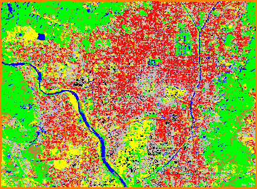

### Octave
Support Vector Machine classification example (classification.sh) with LIBSVM (by Chih-Chung Chang & Chih-Jen Lin). Turned out LIBSVM was easier to run in Bash, so I didn't use Octave interface, except that I did use Octave to (1) prepare data (preparedata.m) and (2) create the predicted image from the prediction result/array (predict2grid.m).

#### Steps
All steps are in "classification.sh"...

#### References:
[LIBSVM -- A Library for Support Vector Machines](https://www.csie.ntu.edu.tw/~cjlin/libsvm/)

[Output example - libsvm_satellite_predicted_georef.tif - in PNG](output_example.png)
